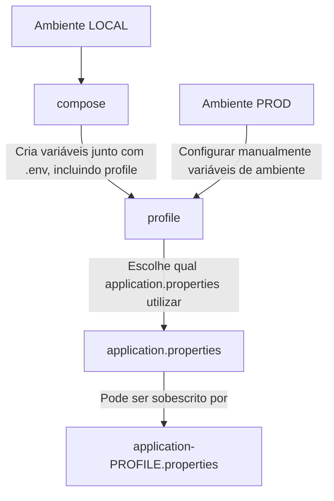

# Contribuindo

## Desenvolvimento local

- Necessário Docker ou alterar `MVN_CANONE` de [Makefile](Makefile)

### Ambiente
- Crie o arquivo `.env` com base no [.env.example](.env.example)
- Suba o container

```shell
make up
```

- Instale as dependências

```shell
make install
```

### Execução

- Após configuração de [ambiente](#ambiente), inicie a aplicação

```shell
make run
```

> Faça debug remoto do JDWP pela porta 5005

- Crie o arquivo `application-local.properties` a partir de [application-local.example.properties](src/main/resources/application-local.example.properties)


### Empacotamento

A solução é entregue através de um *jar*, empacote a aplicação para criar esse artefato

```shell
make package
```

## Problemas conhecidos com Containers

### Limpeza do cache das dependências

```shell
make down
docker rm volume canone_maven-repo
make up
make install
```


## Configurações


